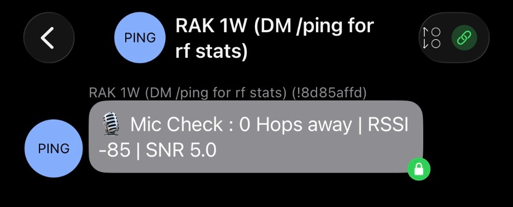

# ReplyBotModule

  
  
  
  

A lightweight Meshtastic firmware module that responds to simple slash commands via direct message to provide quick link health diagnostics. Officially included in the 2.7.19 release. It is disabled by default and must be manually configured in a code editor.

  

ReplyBot adds a friendly, low-overhead auto-responder to your Meshtastic node. When enabled, it listens for simple slash commands and replies with useful diagnostics so you can quickly verify mesh connectivity and link health.

---

## Why ReplyBot?

In a mesh network, it’s not always obvious whether your messages are reaching other nodes—or how good the link actually is.

ReplyBot acts as a quick **“mic check”** for your mesh. You send a command from any Meshtastic device and get an immediate response with real link diagnostics.

Each reply includes:

- **Hop count** — how many relays delivered your message  
- **RSSI** — received signal strength (dBm, normalized if needed)  
- **SNR** — how far above the noise floor your signal is  

This module is intentionally **human-facing**, optimized for clarity and usefulness rather than packet efficiency.

---

## Supported Commands

Commands are case-insensitive and must be prefixed with a slash (`/`). Any extra text after the command is ignored.

| Command | Description |
| --- | --- |
| `/ping` | Confirms the bot is alive and returns diagnostics |
| `/hello` | Alias for `/ping` |
| `/test` | Alias for `/ping` |

### Where commands work

- **Direct Message** → Bot replies directly  
- **Primary Channel broadcast** → Bot sees it and replies via DM  
- **Secondary channels** → Ignored  

ReplyBot runs in *promiscuous mode* so it can see primary‑channel broadcasts without spamming the network.

---

## Example

**Command:**

    /ping

**Reply:**

    🎙️ Mic Check: 1 Hop away | RSSI -75 | SNR 9.4

---

## Rate Limiting

To keep the mesh responsive, ReplyBot enforces per‑sender cooldowns:

| Message Type | Cooldown |
| --- | --- |
| Direct Message | 15 seconds |
| Primary Channel broadcast | 60 seconds |

If you’re rate‑limited, just wait a bit and try again.

---

## Customization

Developers can tune ReplyBot behavior via constants in the source:

- `REPLYBOT_DM_COOLDOWN_MS`  
- `REPLYBOT_LF_COOLDOWN_MS`  
- `REPLYBOT_COOLDOWN_SLOTS`  

Defaults:

- 15‑second DM cooldown  
- 60‑second primary channel cooldown  

Adjust these based on mesh size and traffic density.

---

## How It Works

ReplyBot is written in C++ as part of the Meshtastic firmware.

When compiled in, it:

1. Registers as a text message handler  
2. Listens for incoming text packets  
3. Filters messages addressed to it or broadcast on the primary channel  
4. Parses supported slash commands  
5. Applies per‑sender cooldowns  
6. Computes hop count, RSSI, and SNR  
7. Sends a direct message reply to the sender  

The reply format is customizable, including optional emoji.

---

## Installation

ReplyBot is **not enabled by default**.

To enable it:

1. Open `Variant.h` in the Meshtastic firmware source.  
2. Add the following line:

        #undef MESHTASTIC_EXCLUDE_REPLYBOT

3. Build and flash firmware as usual for your board.

To disable the module, remove the `#undef` line and rebuild.

---

## Troubleshooting

If replies aren’t working:

- Confirm the module is compiled in  
- Use the **primary channel** for broadcasts  
- Respect cooldown limits  
- Verify mesh connectivity  

---

## Shout‑out 

Huge thanks to [lzmesh.com](http://lzmesh.com) for helping me in my advancement of learning Meshtastic.
 

---

## Contributing

Meshtastic is a community‑driven project.

Contributions are welcome—code, documentation, testing, or feedback.  
Open an issue or submit a pull request via the Meshtastic firmware repository.

---

## License

Meshtastic firmware, including this module, is licensed under the  
**GNU General Public License v3.0**. See the `LICENSE` file for details.
