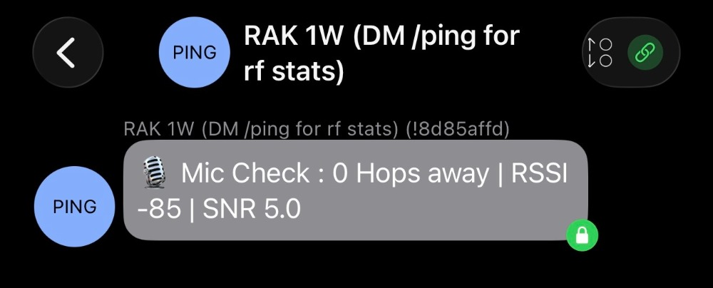

# ReplyBotModule

<p align="center">
  
  
  
  
</p>

A lightweight Meshtastic firmware module that turns a slash command into a practical radio-link check. ReplyBot reports hop count, RSSI, and SNR and is designed to remain useful with modern PKI-based Meshtastic direct messaging.

ReplyBot was originally accepted into Meshtastic firmware in the 2.7.x line. This repository tracks the standalone module, compatibility work, tests, and documentation used to keep it healthy as Meshtastic evolves.

<p align="center">
  
</p>

## What it does

Send one of the supported commands to a ReplyBot-enabled node:

| Command | Description |
| --- | --- |
| `/ping` | Return link diagnostics |
| `/hello` | Alias for `/ping` |
| `/test` | Alias for `/ping` |

Commands are case-insensitive. Leading whitespace is allowed, and text after the command token is ignored.

Example direct reply:

```text
🎙️ Mic Check: 1 Hops | RSSI -75 | SNR 9.4
```

## Modern DM compatibility

Current Meshtastic firmware expects normal text DMs to use PKI and can refuse a unicast when the destination public key is unavailable. That matters to ReplyBot because its original behavior always tried to turn a Primary-channel command into a private reply.

The compatibility rewrite uses this policy:

| Command arrives by | Sender key available | Reply behavior |
| --- | --- | --- |
| Direct message | Any | Direct reply attempt; never made public |
| Primary channel | Yes | Private direct reply |
| Primary channel | No | Primary-channel fallback tagged with requester node ID |
| Secondary channel | Any | Ignored |

A fallback looks like:

```text
🎙️ For !1234abcd: 2 Hops | RSSI -91 | SNR 7.5
```

The module does **not** implement its own crypto. In normal unlicensed operation it checks whether a sender key is available with the same NodeDB key-resolution path used by current firmware and lets the normal Meshtastic router perform PKI encryption and delivery. Licensed/ham mode is allowed to use the firmware's non-PKI unicast path without requiring a sender key.

See [`docs/PKI_COMPATIBILITY.md`](docs/PKI_COMPATIBILITY.md) for the full design rationale and test matrix.

## Rate limiting

ReplyBot remains intentionally conservative with airtime:

| Message type | Per-sender cooldown |
| --- | --- |
| Direct message | 15 seconds |
| Primary-channel command | 60 seconds |

The small fixed-size cooldown table avoids dynamic allocation and keeps memory overhead predictable.

## Why the module listens promiscuously

ReplyBot registers for the text-message port and runs in promiscuous mode so it can observe Primary-channel commands that are not addressed specifically to the bot. It still ignores broadcasts on secondary channels.

This lets a user perform a quick mesh check without already having a working private conversation with the ReplyBot node.

## Diagnostics

Each successful command reports:

- **Hops** — the firmware-derived hop count for the received packet.
- **RSSI** — received signal strength in dBm.
- **SNR** — signal-to-noise ratio reported by the radio.

These are receive-side measurements from the ReplyBot node. They describe the path into the bot, not a full bidirectional link budget.

## Building into Meshtastic firmware

ReplyBot is excluded by default in normal firmware builds. In a Meshtastic source tree that contains the module, enable it for your variant by ensuring the ReplyBot exclusion macro is undefined, for example:

```cpp
#undef MESHTASTIC_EXCLUDE_REPLYBOT
```

Then build and flash firmware normally for the target board.

Because Meshtastic build flags and variant layouts evolve, always compare the standalone files in this repository with the current `meshtastic/firmware` tree before copying them into a new release branch.

## Tests

The transport decision and command parser live in `ReplyBotLogic.h`, which has no Meshtastic dependencies. That allows a small C++11 host test to run without compiling the entire firmware tree.

Run it locally with:

```bash
g++ -std=c++11 -Wall -Wextra -Werror tests/replybot_logic_test.cpp -o /tmp/replybot_logic_test
/tmp/replybot_logic_test
```

GitHub Actions runs the same check on pushes and pull requests.

Host tests cover:

- lowercase and mixed-case commands
- leading whitespace
- command suffix boundaries
- invalid commands
- private-vs-public fallback routing decisions

Radio/device testing is still required before an upstream Meshtastic firmware PR. The recommended hardware matrix is documented in [`docs/PKI_COMPATIBILITY.md`](docs/PKI_COMPATIBILITY.md).

## Source layout

- `ReplyBotModule.cpp` — Meshtastic packet handling, diagnostics, cooldowns, and transmission.
- `ReplyBotModule.h` — firmware module interface.
- `ReplyBotLogic.h` — dependency-free parser and reply-routing policy.
- `tests/replybot_logic_test.cpp` — host-side behavior tests.
- `docs/PKI_COMPATIBILITY.md` — design notes, security rationale, and integration test plan.

## Design goals

ReplyBot should remain:

- small enough to justify living in firmware
- safe for busy meshes
- private when the transport supports it
- useful when a newly discovered node has not exchanged keys yet
- predictable rather than clever
- easy to test as Meshtastic messaging behavior changes

## Contributing

Issues, code, documentation, and radio test reports are welcome. If a Meshtastic firmware change affects direct messaging, key storage, text packet routing, or channel handling, please include the firmware version and the exact ReplyBot command path you tested.

For changes intended for upstream Meshtastic, test against the current `meshtastic/firmware` development branch as well as at least one real device pair.

## Shout-out

Huge thanks to [lzmesh.com](http://lzmesh.com) for helping with Meshtastic experimentation and learning.

<a href="https://discord.gg/FuK8fFjwjq">
  
</a>

## License

Meshtastic firmware and this module are licensed under the **GNU General Public License v3.0**. See [`LICENSE`](LICENSE) for the full text.
